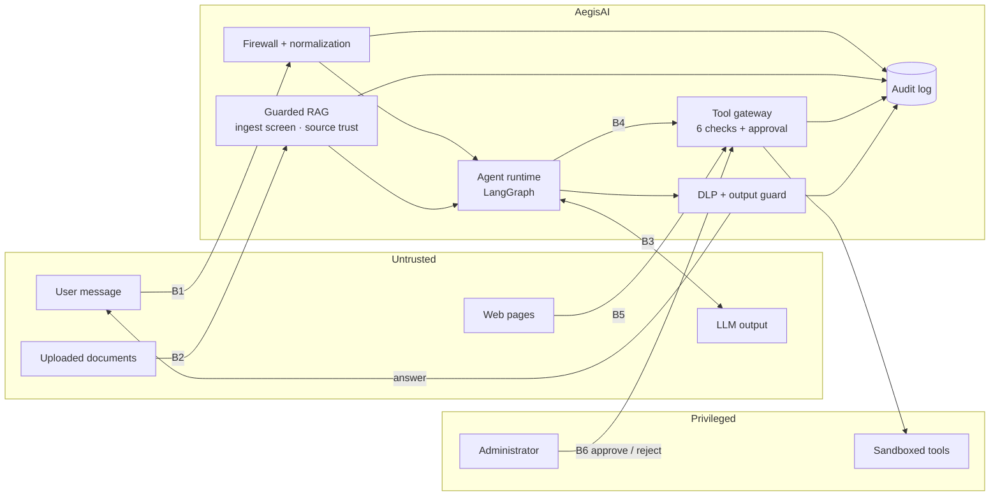

# AegisAI threat model

> Scope: the AegisAI API, agent runtime, tool gateway, guarded RAG pipeline and
> dashboard as shipped in this repository. Last reviewed 2026-10-03.
> The live, evidence-checked version of the threat mapping is the **Threat
> coverage** page (`GET /api/compliance`), generated from
> [`backend/app/compliance/catalog.py`](../backend/app/compliance/catalog.py).

## 1. System in one paragraph

Authenticated users chat with tool-using agents (FinanceAgent, ResearchAgent).
Each turn is a LangGraph workflow:

1. A firewall screens the message.
2. Context is retrieved from a knowledge base screened at ingestion.
3. An LLM (Ollama, or a deterministic planner) proposes tool calls.
4. A zero-trust gateway decides whether each call may run.
5. The answer passes data-loss prevention before it is shown.

Every decision is audited and moves a per-agent trust score. Administrators curate
the knowledge base, policies and trust, and approve high-impact actions.

## 2. Core assumption

**The model is not a security boundary.** Anything an LLM produces (a plan, tool
arguments, an answer) is treated as attacker-influenced. The brain *proposes*; the
gateway *disposes*. Every protection below holds even if the model follows an
injected instruction perfectly.

## 3. Assets

| Asset | Why it matters | Where it lives |
|---|---|---|
| Customer and invoice records | PII and financial data; the main exfiltration target | `read_database` (sandboxed) |
| Agent capabilities | Email, web fetch, database reads are what turn text into impact | Tool gateway, policies |
| Knowledge-base integrity | Poisoned context steers agents and misinforms users | RAG index / pgvector |
| Policies, trust scores, tool registry | They decide what agents may do | Policy store, trust engine |
| Audit trail | Evidence for investigation; attackers want it erased | Audit log / `security_events` |
| Credentials | JWT secret, seed passwords, database URL | Environment |
| System prompts | Leaking them helps attackers tune attacks | Agent brain |

## 4. Trust boundaries

| # | Boundary | What crosses it | Control at the boundary |
|---|---|---|---|
| B1 | User → runtime | Chat messages | Auth + roles, firewall on `USER_INPUT`, trust suspension |
| B2 | Documents → knowledge base | Uploaded / imported files | Admin-only ingest, chunk screening, quarantine, source trust |
| B3 | Runtime ↔ LLM | Context in, plans out | Spotlighting (`<data>` wrapping), step limit, plans treated as untrusted |
| B4 | Runtime → tools | Tool calls | Registry, policy, domain, argument firewall, trust, rate limit, approval |
| B5 | Tools → runtime | Tool output (web pages, DB rows) | Output firewall on `TOOL_OUTPUT` (withhold + penalize source), DLP |
| B6 | Administrator → gateway | Approval decisions | Admin role, atomic claim, full re-check at decision time |

## 5. Adversaries

| Adversary | Capability | Goal |
|---|---|---|
| **A1 Malicious user** | Authenticated, sends arbitrary text, can retry | Jailbreak, extract prompts or data, misuse tools |
| **A2 Content poisoner** | Controls a web page or a document that reaches the agent | Indirect injection: make the agent act on hidden instructions |
| **A3 Hijacked model** | The LLM itself, after a successful injection | Call tools outside its task, exfiltrate via arguments or links |
| **A4 Abusive client** | Unauthenticated network access | Credential stuffing, resource exhaustion |
| **A5 Careless insider** | Staff account | Approve something harmful, erase evidence |

Out of scope: a compromised host, database or administrator account; supply-chain
compromise of models and dependencies (see LLM03 below); attacks on the LLM
provider's infrastructure.

## 6. Threats and mitigations

| Threat | Adversary | OWASP / ATLAS | Mitigations | Status |
|---|---|---|---|---|
| Direct prompt injection and jailbreaks | A1 | LLM01 · AML.T0051.000, T0054 | Firewall with obfuscation normalization; trust penalty and suspension | Mitigated; paraphrases can pass the firewall |
| Indirect injection via documents or web pages | A2 | LLM01 · AML.T0051.001, T0070 | Ingest quarantine; source trust; output firewall withholds tool output; spotlighting | Mitigated; prose-only injections can pass |
| Obfuscated payloads (leetspeak, zero-width, homoglyph, base64) | A1, A2 | AML.T0068 | NFKC + invisible-char stripping, homoglyph map, de-leet, de-space, base64 decode | Mitigated for these encodings |
| Excessive agency: model calls tools it shouldn't | A3 | LLM06 · AML.T0053 | Deny-by-default policies; global kill switches; domain allow-lists; trust gates; rate limits; human approval; sandboxed tools | Mitigated |
| Data exfiltration through tool arguments | A3 | LLM02 · AML.T0057 | Domain allow-list on email/URL arguments; argument firewall; approval for email | Mitigated |
| Sensitive data in answers | A1, A3 | LLM02, LLM05 | DLP: secrets always, PII per agent's sensitive categories; exfiltration-link stripping | Mitigated for pattern-shaped data |
| System prompt extraction | A1 | LLM07 · AML.T0056 | Firewall rules; prompts hold no secrets by design | Mitigated |
| Unsafe output rendered by the dashboard | A2, A3 | LLM05 | Answers rendered as React text, never HTML; CSP from nginx | Mitigated |
| Knowledge-base poisoning | A2 | LLM04, LLM08 | Admin-only ingest; quarantine; per-source trust and penalties; embedding-model consistency | Partial: training data out of scope |
| Misinformation from trusted-looking sources | A2 | LLM09 | Retrieval limited to trusted sources; answers cite sources | Partial: no fact verification |
| Resource exhaustion | A4, A1 | LLM10 · AML.T0029 | Login throttle; per-tool rate limits; step and upload limits | Partial: no per-principal budgets |
| Approval abuse (double execution, stale approval) | A3, A5 | LLM06 | Atomic claim; re-check of every gate at decision time; expiry; reviewer and note recorded | Mitigated |
| Evidence tampering | A5 | — | Postgres mode: audit log not erasable through the API; exports are snapshots | Partial: no signed archive |
| Replay and concurrent turns | A1 | — | Request-ID replay rejection; one turn per session (cross-worker in Postgres mode) | Mitigated |
| Insecure deployment defaults | — | — | Production refuses to start with dev JWT secret or seed passwords | Mitigated |
| Supply chain (models, packages) | — | LLM03 | Not addressed by the runtime layer | **Gap** |

## 7. Security guarantees

These invariants are enforced in code and checked by the test suite on every CI run,
in both memory and PostgreSQL mode.

| # | Guarantee | Enforced by |
|---|---|---|
| G1 | No tool runs except through the gateway, and an unknown tool or agent is denied | `test_unknown_tool_denied`, `test_unknown_agent_denied` |
| G2 | A tool outside an agent's policy is denied, whatever the model asks | `test_tool_outside_agent_policy_denied` |
| G3 | Globally disabled tools (`shell`, `external_upload`) never run | `test_globally_disabled_tool_denied`, `test_shell_request_denied_by_kill_switch` |
| G4 | Email and URL arguments reach only allow-listed domains | `test_domain_allow_list_enforced`, `test_exfiltration_by_email_stopped_at_domain_check` |
| G5 | A high-impact tool runs only after an administrator approves it, at most once, and only if every check still passes at that moment | `tests/test_approvals.py` |
| G6 | Each tool has a minimum trust; repeated attacks remove tool access; agents below 0.2 are refused outright | `test_trust_gate_blocks_high_risk_tool`, `test_repeated_attacks_degrade_tool_access`, `test_suspended_agent_refused` |
| G7 | Injected knowledge-base chunks are quarantined and never retrieved; untrusted sources are dropped | `test_poisoned_chunk_quarantined_and_source_penalized`, `test_untrusted_source_dropped` |
| G8 | Tool output carrying an injection is withheld from the model | `test_injected_tool_output_withheld`, `test_indirect_injection_in_web_page_withheld` |
| G9 | Secrets are always redacted from answers; PII is redacted where the agent's policy marks it sensitive | `tests/test_dlp.py`, `test_customer_pii_redacted_in_answer` |
| G10 | Red-team runs never change live trust scores or the audit log | `test_run_is_sandboxed_from_live_state` |
| G11 | Production refuses to start with development secrets | `tests/test_config.py` |
| G12 | Postgres mode: one turn per session across workers; replayed request IDs rejected; no lost trust updates; audit log not erasable | `tests/test_postgres.py` |
| G13 | Detection does not regress: recall and precision ≥ 90%, false-positive rate ≤ 10%, no benign input blocked, every agent scenario defended | `tests/test_evaluation.py` (CI gate) |

## 8. Residual risks

Stated plainly, as on the Threat coverage page:

- **Paraphrased injections.** The firewall is signature-based and misses attacks
  without trigger words. Two of 43 benchmark attacks pass (FW-007, FW-074). G1–G5
  bound what such an attack can achieve. A semantic detector is on the roadmap.
- **Pattern-based DLP.** Secrets without a recognisable shape can pass.
- **Per-agent, not per-user, authority.** Policies and trust belong to the agent.
  One user's attacks lower the shared agent's trust for everyone, and delegated user
  permissions arrive with SSO and tenancy.
- **Simulated tools.** Real adapters need scoped credentials, timeouts and their own
  output validation before they replace the sandbox.
- **No retention or budgets yet.** The audit log and sessions grow without bound, and
  there are no per-principal token or cost limits (Phase 10).
- **Supply chain.** No SBOM, dependency scanning or model signature checks.

## 9. Keeping this current

- Change `catalog.py` and this document together. `tests/test_compliance.py` fails if
  a catalog reference points at a control, attack family or scenario that no longer
  exists.
- Every new attack that gets through becomes a case in `attack-scenarios/`.
  Keep cases that the firewall misses; they keep the numbers honest.
- Re-run the Red-team lab after any change to rules, policies or thresholds. Threat
  coverage shows whether the claims still hold.
